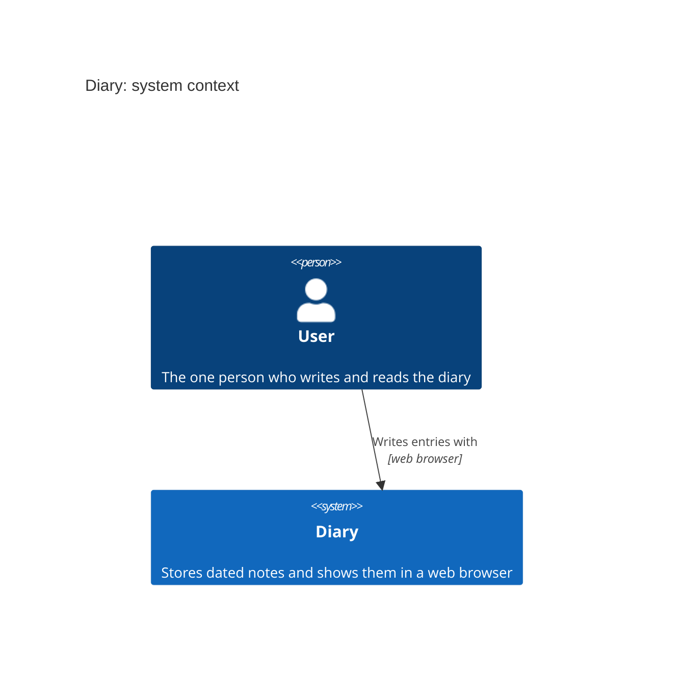
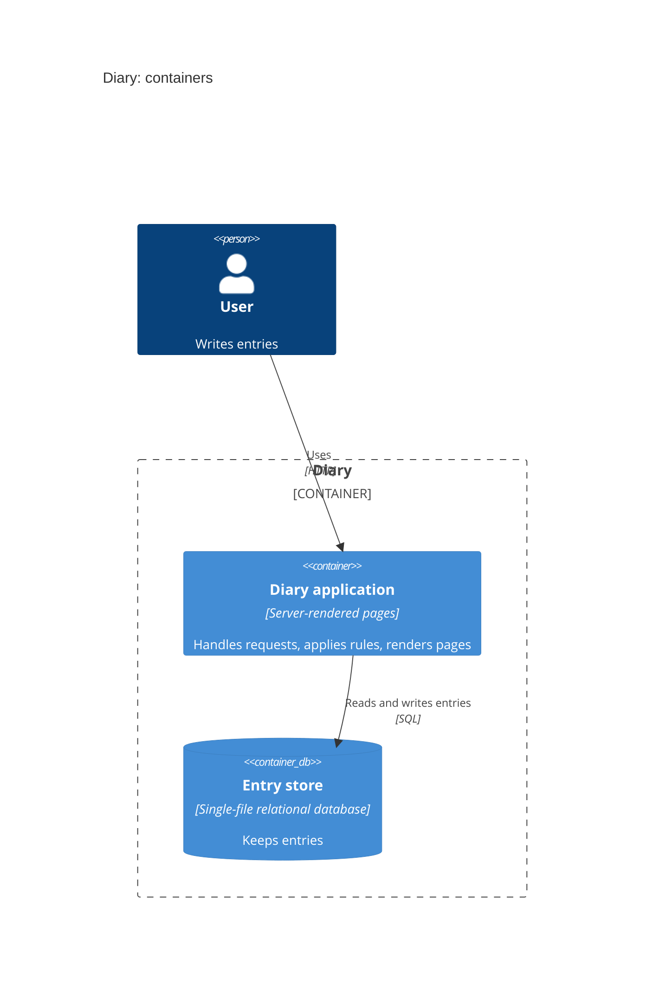

# C4 views

Phase 4 adds the component view.

## Level 1: System context

```mermaid
C4Context
    title Diary: system context
    Person(user, "User", "The one person who writes and reads the diary")
    System(diary, "Diary", "Stores dated notes and shows them in a web browser")
    Rel(user, diary, "Writes entries with", "web browser")
```

## Level 2: Containers

```mermaid
C4Container
    title Diary: containers
    Person(user, "User", "Writes entries")
    Container_Boundary(diary, "Diary") {
        Container(web, "Diary application", "Server-rendered pages", "Handles requests, applies rules, renders pages")
        ContainerDb(store, "Entry store", "Single-file relational database", "Keeps entries")
    }
    Rel(user, web, "Uses", "HTTP")
    Rel(web, store, "Reads and writes entries", "SQL")
```
